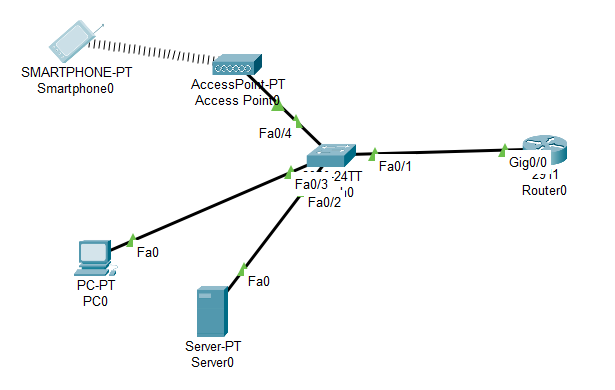

# Cahier des charges simplifié : VibeCheck

## 1. Contexte
* **Situation de départ :** Au quotidien, il est souvent difficile de s'organiser entre le choix de ses tenues vestimentaires et la recherche d'idées de sorties ou d'adresses branchées (cafés, expos, spots). Les inspirations sont souvent éparpillées sur plusieurs plateformes ou supports (captures d'écran, notes).
* **Difficultés rencontrées :** Manque de centralisation, perte de temps pour planifier ses looks selon ses projets et difficulté à retrouver rapidement des bonnes adresses enregistrées.

## 2. Besoin
* Centraliser et simplifier l'organisation de ses looks, de sa garde-robe et de ses projets de sorties dans un seul espace visuel intuitif et moderne.

## 3. Objectif
* Permettre à l'utilisateur de gérer son dressing virtuel, de composer et planifier ses tenues vestimentaires, et de répertorier ses spots de sorties préférés de manière fluide et esthétique.

## 4. Utilisateurs
* **L'utilisateur / Membre :** Gère son dressing, compose ses looks, planifie son calendrier et enregistre ses adresses coups de cœur.
* **L'administrateur :** Gère la plateforme, modère le contenu partagé et assure le bon fonctionnement du site/application.

## 5. Fonctionnalités (Méthode MoSCoW)
* **Must (Indispensable) :** 
  * Créer un compte et se connecter.
  * Ajouter des vêtements et constituer des looks dans un dressing virtuel.
  * Enregistrer des adresses de sorties avec des catégories.
* **Should (Important) :** 
  * Un calendrier interactif pour associer un look et un plan de sortie à une date précise.
* **Could (Optionnel) :** 
  * Un filtre ou une suggestion de tenues adaptée à la météo.
* **Won't (Pas prévu pour l'instant) :** 
  * Intégration d'une e-boutique pour l'achat direct de vêtements en ligne.

## 6. Contraintes
* **Technique :** Utiliser des outils de développement web modernes et gérer un système de base de données pour stocker les profils, les dressings et les adresses.
* **Design / Ergonomie :** Proposer une interface utilisateur (UI/UX) très visuelle, épurée et moderne, parfaitement adaptée à l'univers du lifestyle.
## 🌐 Schéma Réseau

